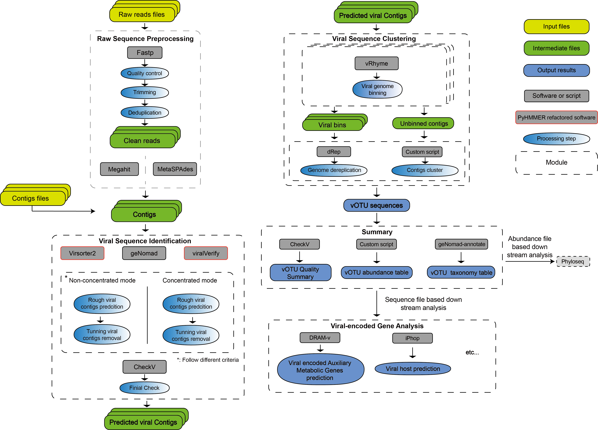

# ViOTUcluster: A High-Speed, All-in-One Pipeline for Virome Analysis from Metagenomic Data
ViOTUcluster is a high-speed, All-in-One solution that streamlines the entire viromics analysis workflow—from raw reads to the generation of viral operational taxonomic units (vOTUs) tables, which include abundance, taxonomy, and quality information, as well as assembled viral genomes, AMG prediction, and host prediction. ViOTUcluster supports the simultaneous processing of multiple samples, efficiently clustering viral sequences across datasets to generate vOTU-related files.




```
Sihang Liu
Dec 2024   
liusihang@tongji.edu.cn
College of Environmental Science and Engineering
Tongji University
```
# Instruction

1. [Prerequisites](#prerequisites)
2. [Installation](#setup-viotucluster-environment)
5. [How to Use](#how-to-use)

7. [File Structure Example](#file-structure-example)
8. [Final Output](#final-output)
9. [Contact](#contact)

______


## Installation
### Prerequisites

- [Miniconda](https://docs.conda.io/en/latest/miniconda.html) or [Anaconda](https://www.anaconda.com/products/distribution)
- [mamba](https://github.com/mamba-org/mamba) (for faster package management)
### Setup ViOTUcluster Environment
1. **Create and activate the ViOTUcluster environment**

    ```bash
    mamba create -n ViOTUcluster -c conda-forge -c bioconda "python=3.8" 
    mamba activate ViOTUcluster
    ```

2. **Download and setup ViOTUcluster**

    ```bash
    git clone https://github.com/liusihang/ViOTUcluster.git
    cd ViOTUcluster-master
    bash setup.sh "/path/to/db" "num"
    ```
    Replace `/path/to/db` with the desired database directory and `num` with the number of threads you wish to use.

   
### Setup vRhyme Environment

If you already have vRhyme environment, you can skip this section.

1. **Create and activate the vRhyme environment**

    ```bash
    mamba env create -f vRhyme.yaml
    mamba activate vRhyme
    ```

2. **Clone the vRhyme repository and install**

    ```bash
    git clone https://github.com/AnantharamanLab/vRhyme
    cd vRhyme
    gunzip vRhyme/models/vRhyme_machine_model_ET.sav.gz
    pip install .
    ```

You can find more information about vRhyme on their website (https://github.com/AnantharamanLab/vRhyme).

### Troubleshooting
If you encounter any issues during the setup or usage of these environments, please refer to the following steps:

Ensure that you have the latest version of mamba and conda.
Check that all dependencies are correctly installed.
Verify that the paths and environment variables are set correctly.
For additional help, feel free to open an issue on the respective GitHub repositories.


## How to Use

To run the pipeline, use the following command structure:

1. **Create and activate the vRhyme environment**

    ```bash
    ViOTUcluster -i <input_path_to_contigs> -r <input_path_raw_seqs> -o <output_path> -d <database_path> -n <threads> --non-con/--con [--reassemble]
    ```

2. **Start with raw fastq files**
    ```bash
    ViOTUcluster_AllinOne -r <input_path_raw_seqs> -o <output_path> -d <database_path> -a <assembly_software> --non-con/--con [--reassemble]
    ```
## Parameters

- **`-i <input_path_to_contigs>`**: Specifies the directory containing the assembled contig files in FASTA format (e.g., `example1.fasta`). Each contig file should have corresponding raw sequencing FASTQ files in the raw sequence directory, sharing the same prefix.

- **`-r <input_path_raw_seqs>`**: Specifies the directory with raw sequencing data in FASTQ format. The FASTQ files must have the same prefix as the corresponding contigs file. For example, if the contigs file is `example1.fasta`, the FASTQ files should be named `example1_R1.fq` and `example1_R2.fq`.

- **`-o <output_path>`**: Defines the output directory for storing the processed results. This will include filtered sequences, prediction outcomes, binning results, and the final dereplicated viral contigs.

- **`-d <database_path>`**: Points to the required database for performing viral prediction, binning, and dereplication steps.

- **`--non-con/--con`**: Specifies the viral prediction criteria based on the sample preparation method. Use `--non-con` for samples that were not enriched using viral-particle concentration methods, typically containing a low viral proportion. Use `--con` for samples subjected to concentration methods, which are expected to have a medium to high viral proportion.

- **`--reassemble`**: (Optional) Enables reassembly of bins after the initial binning process to enhance the accuracy and quality of the final contigs. This feature is still in beta and can significantly increase runtime.

- **`-a <assembly_software>`**: (For `ViOTUcluster_AllinOne` only) Specifies the assembly software used during the raw sequence processing. Accepted values are `-a megahit` or `-a metaspades`.
### File Structure Example

Below is a tree list of how the file structure should be organized, assuming the prefix for the example files is `example1`:

```plaintext
<project_directory>/
│
├── input_contigs/
│   ├── example1.fasta
│   ├── example2.fasta
│   └── ...
│
├── input_fastq/
│   ├── example1_R1.fq
│   ├── example1_R2.fq
│   ├── example2_R1.fq
│   ├── example2_R2.fq
│   └── ...
│
├── output_path/
│   ├── Summary/
│   │   ├── SeperateRes
│   │   │   ├── example1_viralseqs.fasta
│   │   │   ├── example2_viralseqs.fasta
│   │   │   └── ... 
│   │   ├── vOTU
│   │   │    ├── vOTU.fasta
│   │   │    ├── vOTU.Abundance.csv
│   │   │    ├── vOTU.Taxonomy.csv
│   │   │    └── CheckVRes
│   │   ├── DRAMRes(Optional)
│   │   └── iPhopRes(Optional)
│   └── (IntermediateFile....)
│
└── databases/
    ├── db/                # VirSorter2 database
    ├── viralVerify/       # ViralVerify database
    ├── checkv-db-v1.5/    # CheckV database (version 1.5)
    └── genomad_db/        # Genomad database
```


- `input_contigs/` contains the assembled contigs (e.g., `example1.fasta`).
- `input_fastq/` contains the corresponding FASTQ files (e.g., `example1_R1.fq` and `example1_R2.fq`).
- `output_results/` is the directory where all output files will be stored.
- `databases/` contains the required databases for the analysis, including:
  - `db/`: The VirSorter2 database.
  - `ViralVerify/`: The ViralVerify database.
  - `checkv-db-v1.5/`: The CheckV database (version 1.5).
  - `genomad_db/`: The Genomad database.

### Final Output

The processed data is organized under the specified `output_path/`, with the following structure:

- **`output_path/Summary`**: Contains the final results and summaries for all processed samples, organized into the following subdirectories:
  - **`SeperateRes`**: Holds individual directories for each sample (e.g., `example1`, `example2`):
    - **`<sample>_viralseqs.fasta`**: The list of predicted viral contigs for the respective sample.
  - **`vOTU/`**: Contains the final processed viral OTU (vOTU) results across all samples:
    - **`vOTU.fasta`**: The final dereplicated viral contigs after clustering from all samples.
    - **`vOTU.Abundance.csv`**: Abundance data of the vOTUs across samples.
    - **`vOTU.Taxonomy.csv`**: Taxonomic assignments for the vOTUs, if available.
    - **`CheckVRes`**: Summarized CheckV quality assessments for final vOTUs file.
    - **`DRAMRes (Optional)`**: Optional results from DRAM annotation if included in the workflow.
    - **`iPhopRes (Optional)`**: Optional results from iPhop annotation if included in the workflow.

- **`output_path/IntermediateFile`**: This directory holds intermediate files generated during the processing pipeline, such as filtered sequences and any temporary data.

- **`databases/`**: Stores the necessary databases used for various stages of the analysis:
  - **`db/`**: The VirSorter2 database.
  - **`ViralVerify/`**: The ViralVerify database, used for viral prediction.
  - **`checkv-db-v1.5/`**: The CheckV database (version 1.5) for quality control of viral sequences.
  - **`genomad_db/`**: The Genomad database for viral identification and dereplication.

## Acknowledgement

ViOTUcluster integrates state-of-the-art viromics analysis tools. The main tools within ViOTUcluster are listed below.

[fastp](fastp): [ Online Publication](https://doi.org/10.1002/imt2.107)

```
Shifu Chen. 2023. Ultrafast one-pass FASTQ data preprocessing, quality control, and deduplication using fastp. iMeta 2: e107.
```
[MEGAHIT](https://github.com/voutcn/megahit): [ Online Publication](https://doi.org/10.1093/bioinformatics/btv033)

```
MEGAHIT: An ultra-fast single-node solution for large and complex metagenomics assembly via succinct de Bruijn graph. Bioinformatics
```

[SPAdes](https://github.com/ablab/spades): [ Online Publication](https://doi.org/10.1002/cpbi.102)

```
Prjibelski, A., Antipov, D., Meleshko, D., Lapidus, A., & Korobeynikov, A. (2020). Using SPAdes de novo assembler. Current Protocols in Bioinformatics, 70, e102. 
```

[geNomad](https://github.com/apcamargo/genomad): [ Online Publication](https://doi.org/10.1038/s41587-023-01953-y)

```
Camargo, Antonio Pedro, Simon Roux, Frederik Schulz, Michal Babinski, Yan Xu, Bin Hu, Patrick SG Chain, Stephen Nayfach, and Nikos C. Kyrpides. "Identification of mobile genetic elements with geNomad." Nature Biotechnology (2023): 1-10. 
```

[viralVerify](https://github.com/ablab/viralVerify): [ Online Publication](https://doi.org/10.1093/bioinformatics/btaa490)
```
Dmitry Antipov, Mikhail Raiko, Alla Lapidus, Pavel A Pevzner, MetaviralSPAdes: assembly of viruses from metagenomic data, Bioinformatics, Volume 36, Issue 14, July 2020, Pages 4126–4129
```

[VirSorter2](https://github.com/jiarong/VirSorter2): [ Online Publication](https://doi.org/10.1186/s40168-020-00990-y)

```
Guo, Jiarong, Ben Bolduc, Ahmed A. Zayed, Arvind Varsani, Guillermo Dominguez-Huerta, Tom O. Delmont, Akbar Adjie Pratama et al. "VirSorter2: a multi-classifier, expert-guided approach to detect diverse DNA and RNA viruses." Microbiome 9 (2021): 1-13.
```

[PyHMMER](https://github.com/althonos/pyhmmer): [ Online Publication](https://doi.org/10.1093/bioinformatics/btad214)

```
Martin Larralde, Georg Zeller, PyHMMER: a Python library binding to HMMER for efficient sequence analysis, Bioinformatics, Volume 39, Issue 5, May 2023, btad214
```

[CheckV](https://bitbucket.org/berkeleylab/CheckV): [ Online Publication](https://doi.org/10.1038/s41587-020-00774-7)

```
Nayfach, S., Camargo, A.P., Schulz, F. et al. CheckV assesses the quality and completeness of metagenome-assembled viral genomes. Nat Biotechnol 39, 578–585 (2021)
```

[vRhyme](https://github.com/AnantharamanLab/vRhyme): [ Online Publication](https://doi.org/10.1093/nar/gkac341)

```
Kieft, Kristopher, Alyssa Adams, Rauf Salamzade, Lindsay Kalan, and Karthik Anantharaman. "vRhyme enables binning of viral genomes from metagenomes." Nucleic Acids Research 50, no. 14 (2022): e83-e83.
```

[dRep](https://github.com/MrOlm/drep): [ Online Publication](https://doi.org/10.1038/ismej.2017.126)

```
Olm, M., Brown, C., Brooks, B. et al. dRep: a tool for fast and accurate genomic comparisons that enables improved genome recovery from metagenomes through de-replication. ISME J 11, 2864–2868 (2017)
```

[CheckM](https://github.com/Ecogenomics/CheckM): [ Online Publication](https://doi.org/10.1101/gr.186072.114)

```
Parks DH, Imelfort M, Skennerton CT, Hugenholtz P, Tyson GW. CheckM: assessing the quality of microbial genomes recovered from isolates, single cells, and metagenomes. Genome Res. 2015 Jul;25(7):1043-55
```

[BWA](https://github.com/lh3/bwa): [ Online Publication](https://arxiv.org/abs/1303.3997)

```
Aligning sequence reads, clone sequences and assembly contigs with BWA-MEM.
```

[DRAM](DRAM): [ Online Publication](https://doi.org/10.1093/nar/gkaa621)

```
Michael Shaffer, Mikayla A Borton, Bridget B McGivern, Ahmed A Zayed, Sabina Leanti La Rosa, Lindsey M Solden, Pengfei Liu, Adrienne B Narrowe, Josué Rodríguez-Ramos, Benjamin Bolduc, M Consuelo Gazitúa, Rebecca A Daly, Garrett J Smith, Dean R Vik, Phil B Pope, Matthew B Sullivan, Simon Roux, Kelly C Wrighton, DRAM for distilling microbial metabolism to automate the curation of microbiome function, Nucleic Acids Research, Volume 48, Issue 16, 18 September 2020, Pages 8883–8900
```

[iPHoP](https://bitbucket.org/srouxjgi/iphop/src/main/): [ Online Publication](https://www.biorxiv.org/content/10.1101/2022.07.28.501908v1)

```
Roux, Simon, Antonio Pedro Camargo, Felipe Hernandes Coutinho, Shareef M. Dabdoub, Bas E. Dutilh, Stephen Nayfach, and Andrew Tritt. "iPHoP: an integrated machine-learning framework to maximize host prediction for metagenome-assembled virus genomes." bioRxiv (2022): 2022-07.
```

______
## Contact
Feel free to contact Sihang Liu (liusihang@tongji.edu.cn or GitHub Issues) with any questions or comments!

```
####################################################################################################
██╗   ██╗██╗ ██████╗ ████████╗██╗   ██╗ ██████╗██╗     ██╗   ██╗███████╗████████╗███████╗██████╗ 
██║   ██║██║██╔═══██╗╚══██╔══╝██║   ██║██╔════╝██║     ██║   ██║██╔════╝╚══██╔══╝██╔════╝██╔══██╗
██║   ██║██║██║   ██║   ██║   ██║   ██║██║     ██║     ██║   ██║███████╗   ██║   █████╗  ██████╔╝
╚██╗ ██╔╝██║██║   ██║   ██║   ██║   ██║██║     ██║     ██║   ██║╚════██║   ██║   ██╔══╝  ██╔══██╗
 ╚████╔╝ ██║╚██████╔╝   ██║   ╚██████╔╝╚██████╗███████╗╚██████╔╝███████║   ██║   ███████╗██║  ██║
  ╚═══╝  ╚═╝ ╚═════╝    ╚═╝    ╚═════╝  ╚═════╝╚══════╝ ╚═════╝ ╚══════╝   ╚═╝   ╚══════╝╚═╝  ╚═╝
####################################################################################################
```
______

## Copyright
ViOTUcluster Copyright (C) 2024 

This program is free software: you can redistribute it and/or modify it under the terms of the GNU General Public License, version 2, as published by the Free Software Foundation.

This program is distributed in the hope that it will be useful, but WITHOUT ANY WARRANTY; without even the implied warranty of MERCHANTABILITY or FITNESS FOR A PARTICULAR PURPOSE. See the GNU General Public License for more details.

You should have received a copy of the GNU General Public License along with this program. If not, see https://www.gnu.org/licenses/old-licenses/gpl-2.0.en.html.
