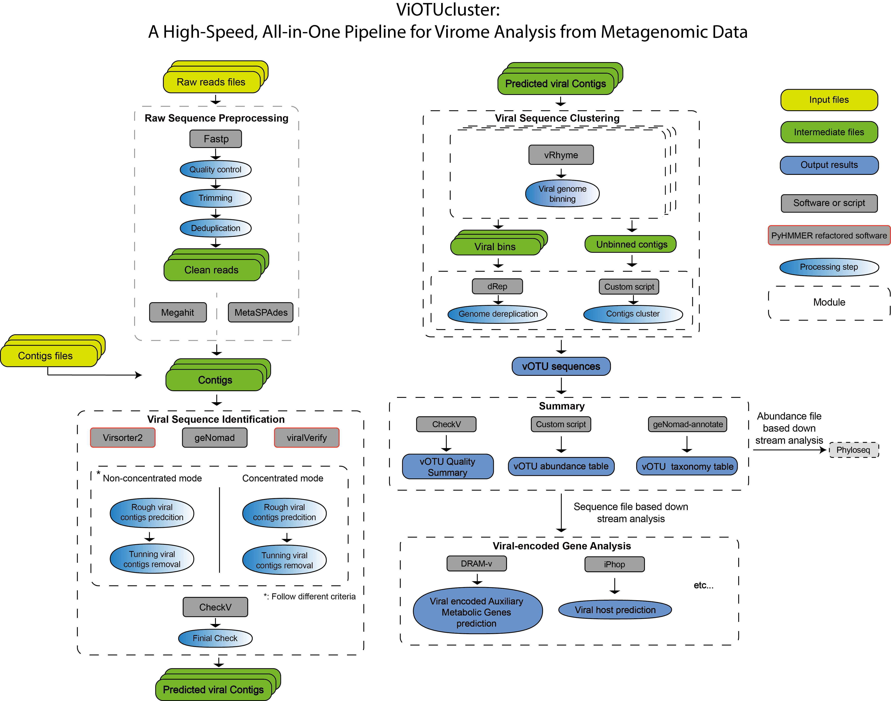

# ViOTUcluster: A High-Speed, All-in-One Pipeline for Viromic Analysis from Metagenomic Data
[](https://pypi.org/project/ViOTUcluster/)

ViOTUcluster is a high-speed, All-in-One solution that streamlines the entire viromics analysis workflow—from raw reads to the generation of viral operational taxonomic units (vOTUs) tables, which include abundance, taxonomy, and quality information, as well as assembled viral genomes, AMG prediction, and host prediction. ViOTUcluster supports the simultaneous processing of multiple samples, efficiently clustering viral sequences across datasets to generate vOTU-related files.



```
Sihang Liu
Dec 2024   
liusihang@tongji.edu.cn
College of Environmental Science and Engineering
Tongji University 
```
## Full Text & Citation
See more details in the [manuscript](https://doi.org/10.1002/imo2.70023) on iMetaOmics: 

```tex
Liu, S., Ye, Y., Guo, B., Hu, Y., Jiang, K., Liang, C., Xia, S. and Wang, H. (2025), ViOTUcluster: A high-speed, All-in-one pipeline for viromic analysis of metagenomic data. iMetaOmics e70023. https://doi.org/10.1002/imo2.70023
```
# Instruction
Demo for using ViOTUcluster

[](https://asciinema.org/a/710742)

_Recorded with [asciinema](https://docs.asciinema.org)_ 

#

1. [Prerequisites](#prerequisites)
2. [Installation](#installation)
3. [How to Use](#how-to-use)
4. [File Structure Example](#file-structure-example)
5. [Final Output](#final-output)
6. [Contact](#contact)

______
## Important updates

- Version 0.6.0: Promoted the validated Conda/Bioconda installation path and hardened the default runtime/database contract for new users.
- Version 0.5.7.2: Added the `--save-sambamba-intermediate` flag (also available in `ViOTUcluster_AllinOne`) so you can keep Sambamba view BAMs when troubleshooting heavy IO pressure.
- Version 0.5.5: Added three concurrency controls options,`--max-prediction-tasks (-P)`, `--tpm-tasks (-T)`, `--assemble-jobs (-A)`, which could help to limit the over memory usage.

## Prerequisites

Before installing ViOTUcluster, ensure the following tools are available on your system:

- [Miniconda](https://docs.conda.io/en/latest/miniconda.html) or [Anaconda](https://www.anaconda.com/products/distribution)
- [mamba](https://github.com/mamba-org/mamba)
- [Git](https://git-scm.com/downloads) (only needed for the fallback source install path)

## Installation

ViOTUcluster has been tested on Ubuntu and CentOS and should be compatible with all Linux distributions.

### First-Time Installation of ViOTUcluster

Follow these steps to install ViOTUcluster for the first time:

### Preferred Installation: Bioconda + mamba

The preferred installation path is now:

```bash
mamba install -c conda-forge -c bioconda viotucluster
```

This installs the validated default main workflow runtime, including the Python
CLI package and the core external tools used by `ViOTUcluster` and
`ViOTUcluster_AllinOne`.

If the Bioconda package has not been published yet in your environment or mirror,
use the source-based fallback installation below until the package becomes
available.

After installation, activate the target Conda environment and verify the
runtime commands:

```bash
conda activate <your-environment>
ViOTUcluster_Check
```

### Fallback Installation: Source Checkout + Conda Manifest

ViOTUcluster also ships with checked-in Conda environment manifests for users
who want a source-based install or need to patch the runtime locally.

The supported source layout is:

- one main Conda environment for the standard `ViOTUcluster` / `ViOTUcluster_AllinOne` workflow,
- optional satellite environments for advanced analyses that are not safely co-installable with the default stack.

The main reason for this split is `iPhop`: its current Conda package still pins an older Python/TensorFlow stack that conflicts with the current `geNomad` runtime requirements.

1. **Clone the repository**

   ```bash
   git clone https://github.com/liusihang/ViOTUcluster.git
   cd ViOTUcluster
   ```

2. **Create the main Conda environment**

   Recommended direct path:

   ```bash
   conda env create -f environment.yml
   conda activate ViOTUcluster
   ```

   If you prefer a custom prefix:

   ```bash
   conda env create -p /PATH/YOU/WANT/ViOTUcluster -f environment.yml
   conda activate /PATH/YOU/WANT/ViOTUcluster
   ```

   The checked-in helper script wraps the same contract and can also create optional satellite environments:

   ```bash
   ./setup_ViOTUcluster.sh --with-dram --with-iphop
   ```

   Optional helper flags:

   | Option | What it does |
   | --- | --- |
   | `-p PATH` | Install the main environment at `PATH/ViOTUcluster`. |
   | `--with-dram` | Create the optional DRAM satellite environment under `<main-env>/envs/DRAM`. |
   | `--with-iphop` | Create the optional iPhop satellite environment under `<main-env>/envs/iPhop`. |
   | `--all-optional` | Create both optional satellite environments. |
   | `--china` | Print a reminder to configure Conda mirrors before solving. |
   | `-h`, `--help` | Show the full option list. |

3. **Verify Installation of All Dependencies**

   To confirm that all required dependencies are correctly installed, run:

   ```bash
   conda activate ViOTUcluster
   ViOTUcluster_Check
   ```

   A successful check will produce output similar to this:

   ```bash
   Checking dependencies...
   [✅] conda is installed.
   [✅] fastp is installed.
   [✅] megahit is installed.
   [✅] metaspades.py is installed.
   [✅] virsorter is installed.
   [✅] viralverify is installed.
   [✅] genomad is installed.
   [✅] checkv is installed.
   [✅] dRep is installed.
   [✅] vRhyme is installed.
   [✅] bwa is installed.
   [✅] sambamba is installed.
   [✅] coverm is installed.
   [✅] parallel is installed.
   [✅] makeblastdb is installed.
   [✅] blastn is installed.
   All dependencies are installed.
   ```

   **Note:** `ViOTUcluster_Check` validates the runtime commands that the pipeline will call directly. `viralverify` can still be satisfied by a sibling Conda environment in older deployments, and `vRhyme` can still be satisfied by a nested satellite environment under `<main-env>/envs/vRhyme` for backward compatibility.

### Database Setup

Both the Bioconda install path and the source install path still require the
external databases.

4. **Set Up Databases**

   ```bash
   ViOTUcluster_download-database "/path/to/db" "num"
   ```

   If the specified directory (`/path/to/db`) does not already contain the required databases, the script will download and install them automatically. Replace `/path/to/db` with your preferred database directory and `num` with the number of threads to use during installation.

   **Note:** The setup process involves downloading approximately **30 GB** of database files, so the installation time depends heavily on your **network speed**. A stable, high-speed internet connection is recommended to prevent installation failures.

### Optional Advanced Analysis Environments

5. **Set Up DRAM and iPhop Environments（Optional for advanced analysis）**

   The standard pipeline can run from the main `ViOTUcluster` environment. DRAM and iPhop stay optional.

   - DRAM is optional to keep the default install smaller.
   - iPhop is optional because its current Conda stack conflicts with the current geNomad stack, so it should remain isolated.

   To create the optional environments under the expected runtime paths:

   ```bash
   ./setup_ViOTUcluster.sh --with-dram --with-iphop
   ```

   #### Install DRAM Database

   To install the DRAM database, first activate the `ViOTUcluster` environment and then run the setup command:

   ```bash
   conda activate ViOTUcluster
   DRAM-setup.py download "/path/to/db/DRAM"
   ```

   If you have an existing DRAM environment and want to migrate its settings, follow these steps:

   1. **Export Configuration from the Old Environment**:
      ```bash
      conda activate old_DRAM_env
      DRAM-setup.py export_config > my_old_config.txt
      ```

   2. **Import the Configuration into the New Environment**:
      ```bash
      conda activate ViOTUcluster
      DRAM-setup.py import_config my_old_config.txt
      ```

   ### Install iPhop Database

   To install the iPhop database, activate the `ViOTUcluster` environment and run the database download command:

   ```bash
   conda activate ViOTUcluster
   iPhop-setup.py "/path/to/db"
   ```

   ### Important Notes

   - **Database Storage**: Ensure that the databases for both DRAM and iPhop are stored in the directory specified during the `ViOTUcluster_download-database` step.
   - **Expected Database Structure**: For details on the expected database structure, refer to the [File Structure Example](#file-structure-example) section.
   - **Official Documentation**: For additional instructions on downloading and configuring these databases, refer to the official documentation for:
      - [DRAM](https://github.com/WrightonLabCSU/DRAM)
      - [iPhop](https://bitbucket.org/srouxjgi/iphop/src/main/).


6. **Test the Complete ViOTUcluster Workflow with Mini-Samples**
  
   To verify ViOTUcluster full workflow are functioning correctly, you can run a test using the `ViOTUcluster_Test` command with a set of mini FASTQ samples.
   ```bash
   conda activate ViOTUcluster
   ViOTUcluster_Test -d /path/to/db
   ```
   This command will automatically utilize all available threads to execute the entire ViOTUcluster workflow on the provided mini FASTQ samples. Be sure to replace /path/to/db with the path to your database directory.

   If you want a lighter smoke test while debugging orchestration or environment issues, you can also run the All-in-One entrypoint with reduced concurrency and disabled binning:

   ```bash
   conda activate ViOTUcluster
   ViOTUcluster_AllinOne \
     -r /path/to/MiniTest \
     -o /path/to/smoke_output \
     -d /path/to/db \
     -a megahit \
     --con \
     --disable-binning \
     -n 4 -P 1 -T 1 -A 1 \
     --module-timeout-hours 1
   ```

### Updating ViOTUcluster from an Older Version

If you installed ViOTUcluster from Bioconda, update it with:

```bash
mamba update -c conda-forge -c bioconda viotucluster
```

If you installed from this repository, update the code and then refresh the main environment from the checked-in manifest:

```bash
git pull
conda env update -f environment.yml --prune
conda activate ViOTUcluster
python -m pip install --no-deps --upgrade .
```

If you rely on the optional DRAM or iPhop satellite environments, rerun `./setup_ViOTUcluster.sh --with-dram` and/or `./setup_ViOTUcluster.sh --with-iphop` after pulling updates.


## Additional Notes

If you run into any difficulties while setting up these environments, feel free to report them by opening an issue on the respective GitHub or Bitbucket repositories for [DRAM](https://github.com/WrightonLabCSU/DRAM) or [iPhop](https://bitbucket.org/srouxjgi/iphop/src/main/).

---


## How to Use

To run the pipeline, use the following command structure:

1. **Run from assembled contigs plus raw reads**

    ```bash
    ViOTUcluster -i <input_path_to_contigs> -r <input_path_raw_seqs> -o <output_path> -d <database_path> -n <threads> -m <min-sequence length> --non-con/--con [--reassemble] [--disable-binning] [--save-sambamba-intermediate] [--max-prediction-tasks <N>] [--tpm-tasks <N>] [--assemble-jobs <N>] [--module-timeout-hours <H>]
    ```

2. **Start directly from raw FASTQ files**

    ```bash
    ViOTUcluster_AllinOne -r <input_path_raw_seqs> -o <output_path> -d <database_path> -a <assembly_software> -n <threads> -m <min-sequence length> --non-con/--con [--reassemble] [--disable-binning] [--save-sambamba-intermediate] [--max-prediction-tasks <N>] [--tpm-tasks <N>] [--assemble-jobs <N>] [--module-timeout-hours <H>]
    ```

A mini test file is available for download at  [MiniTest.zip](https://zenodo.org/records/14287325/files/MiniTest.zip?download=1). You can use this file in All-in-One mode to verify that the pipeline is successfully installed and functioning.

## Parameters

- **`-i <input_path_to_contigs>`**: Specifies the directory containing the assembled contig files in FASTA format (e.g., `example1.fasta`). Each contig file should have corresponding raw sequencing FASTQ files in the raw sequence directory, sharing the same prefix.

- **`-r <input_path_raw_seqs>`**: Specifies the directory with raw sequencing data in FASTQ format. The FASTQ files must have the same prefix as the corresponding contigs file. For example, if the contigs file is `example1.fasta`, the FASTQ files should be named `example1_R1.fq` and `example1_R2.fq`. The paired-end metagenomic reads should end with `.fq`, `.fq.gz`, `.fastq`, or `.fastq.gz`.

- **`-o <output_path>`**: Defines the output directory for storing the processed results. This will include filtered sequences, prediction outcomes, binning results, and the final dereplicated viral contigs.

- **`-d <database_path>`**: Points to the required database for performing viral prediction, binning, and dereplication steps.

- **`-m, --min-length <length>`**: Specify the minimum length (bp) for sequences (default: 2500). The same value is applied during initial contig filtering and again before dRep clustering to keep downstream analyses in sync with the user input.

- **`-n, --threads <N>`**: Sets the per-task thread budget passed to heavy external tools. Combine this with `-P`, `-T`, and `-A` to control total host utilization.

- **`--non-con/--con`**: Specifies the viral prediction criteria based on the sample preparation method. Use `--non-con` for samples that were not enriched using viral-particle concentration methods, typically containing a low viral proportion. Use `--con` for samples subjected to concentration methods, which are expected to have a medium to high viral proportion.

- **`--reassemble`**: (Optional) Enables reassembly of bins after the initial binning process to enhance the accuracy and quality of the final contigs. This feature is still in beta and can significantly increase runtime.

- **`--disable-binning`**: Skip the vRhyme binning stage entirely. When enabled, the pipeline stages the post-cross-validation per-sample viral contigs into the unbinned dereplication and summary flow, which is useful when bins cannot be recovered for some samples.
- **`--module-timeout-hours <hours>`**: Abort a top-level pipeline stage if it runs longer than the configured number of hours. Use `0` to disable the timeout entirely.
- **`--save-sambamba-intermediate`**: Keep Sambamba view BAMs before sorting. This reduces open-file pressure during heavy runs and keeps intermediate BAMs on disk for debugging at the cost of additional storage.

- **`-a <assembly_software>`**: (For `ViOTUcluster_AllinOne` only) Specifies the assembly software used during the raw sequence processing. Accepted values are `-a megahit` or `-a metaspades`.

- **`--max-prediction-tasks, -P <N>`**: Cap total concurrent prediction jobs (e.g., viralverify/virsorter2/genomad), default 30.

- **`--tpm-tasks, -T <N>`**: Cap concurrent BAM/TPM processing samples, default 15.

- **`--assemble-jobs, -A <N>`**: Cap concurrent assembly samples, default 10.

- **`ViOTUcluster_Check`**: Use this before long runs to confirm the command-line tools that the pipeline expects are visible from your current shell.

### File Structure Example

Below is a tree list of how the file structure should be organized, assuming the prefix for the example files is `example1`:

```plaintext
<project_directory>/
│
├── input_contigs/
│   ├── example1.fasta
│   ├── example2.fasta
│   └── ...
│
├── input_fastq/
│   ├── example1_R1.fq
│   ├── example1_R2.fq
│   ├── example2_R1.fq
│   ├── example2_R2.fq
│   └── ...
│
├── output_path/
│   ├── Summary/
│   │   ├── SeperateRes
│   │   │   ├── example1_viralseqs.fasta
│   │   │   ├── example2_viralseqs.fasta
│   │   │   └── ... 
│   │   ├── vOTU
│   │   │    ├── vOTU.fasta
│   │   │    ├── vOTU.Abundance.csv
│   │   │    ├── vOTU.Taxonomy.csv
│   │   │    └── CheckVRes
│   │   ├── DRAMRes(Optional)
│   │   │    ├── DRAM_annotations.tsv
│   │   │    └── DRAM_Gene.Abundance.csv
│   │   └── iPhopRes(Optional)
│   └── (IntermediateFile....)
│
└── databases/
    ├── db/                # VirSorter2 database
    ├── viralVerify/       # ViralVerify database
    ├── checkv-db-v1.5/    # CheckV database (version 1.5)
    ├── genomad_db/        # Genomad database
    └── Aug_2023_pub_rw/   # iPhop database
```

- `input_contigs/` contains the assembled contigs (e.g., `example1.fasta`).
- `input_fastq/` contains the corresponding FASTQ files (e.g., `example1_R1.fq` and `example1_R2.fq`).
- `output_results/` is the directory where all output files will be stored.
- `databases/` contains the required databases for the analysis, including:
  - `db/`: The VirSorter2 database.
  - `ViralVerify/`: The ViralVerify database.
  - `checkv-db-v1.5/`: The CheckV database (version 1.5).
  - `genomad_db/`: The Genomad database.

### Final Output

The processed data is organized under the specified `output_path/`, with the following structure:

- **`output_path/Summary`**: Contains the final results and summaries for all processed samples, organized into the following subdirectories:
  - **`SeperateRes`**: Holds individual directories for each sample (e.g., `example1`, `example2`):
    - **`<sample>_viralseqs.fasta`**: The list of predicted viral contigs for the respective sample.
  - **`vOTU/`**: Contains the final processed viral OTU (vOTU) results across all samples:
    - **`vOTU.fasta`**: The final dereplicated viral contigs after clustering from all samples.
    - **`vOTU.Abundance.csv`**: Abundance data of the vOTUs across samples.
    - **`vOTU.Taxonomy.csv`**: Taxonomic assignments for the vOTUs, if available.
    - **`CheckVRes`**: Summarized CheckV quality assessments for final vOTUs file.
  - **`DRAMRes (Optional)`**: Optional functional annotations from DRAM if the advanced analysis stage is executed.
    - **`DRAM_annotations.tsv`**: Aggregated DRAM annotations for all predicted genes.
    - **`DRAM_Gene.Abundance.csv`**: TPM-based abundance estimates for each DRAM-predicted gene across samples.
  - **`iPhopRes (Optional)`**: Optional results from iPhop annotation if included in the workflow.

- **`output_path/IntermediateFile`**: This directory holds intermediate files generated during the processing pipeline, such as filtered sequences and any temporary data.

- **`databases/`**: Stores the necessary databases used for various stages of the analysis:
  - **`db/`**: The VirSorter2 database.
  - **`ViralVerify/`**: The ViralVerify database, used for viral prediction.
  - **`checkv-db-v1.5/`**: The CheckV database (version 1.5) for quality control of viral sequences.
  - **`genomad_db/`**: The Genomad database for viral identification and dereplication.

## Acknowledgement

ViOTUcluster integrates state-of-the-art viromics analysis tools. The main tools within ViOTUcluster are listed below.

[fastp](fastp): [Online Publication](https://doi.org/10.1002/imt2.107)

```
Shifu Chen. 2023. Ultrafast one-pass FASTQ data preprocessing, quality control, and deduplication using fastp. iMeta 2: e107.
```

[MEGAHIT](https://github.com/voutcn/megahit): [Online Publication](https://doi.org/10.1093/bioinformatics/btv033)

```
MEGAHIT: An ultra-fast single-node solution for large and complex metagenomics assembly via succinct de Bruijn graph. Bioinformatics
```

[SPAdes](https://github.com/ablab/spades): [Online Publication](https://doi.org/10.1002/cpbi.102)

```
Prjibelski, A., Antipov, D., Meleshko, D., Lapidus, A., & Korobeynikov, A. (2020). Using SPAdes de novo assembler. Current Protocols in Bioinformatics, 70, e102. 
```

[geNomad](https://github.com/apcamargo/genomad): [Online Publication](https://doi.org/10.1038/s41587-023-01953-y)

```
Camargo, Antonio Pedro, Simon Roux, Frederik Schulz, Michal Babinski, Yan Xu, Bin Hu, Patrick SG Chain, Stephen Nayfach, and Nikos C. Kyrpides. "Identification of mobile genetic elements with geNomad." Nature Biotechnology (2023): 1-10. 
```

[viralVerify](https://github.com/ablab/viralVerify): [Online Publication](https://doi.org/10.1093/bioinformatics/btaa490)

```
Dmitry Antipov, Mikhail Raiko, Alla Lapidus, Pavel A Pevzner, MetaviralSPAdes: assembly of viruses from metagenomic data, Bioinformatics, Volume 36, Issue 14, July 2020, Pages 4126–4129
```

[VirSorter2](https://github.com/jiarong/VirSorter2): [Online Publication](https://doi.org/10.1186/s40168-020-00990-y)

```
Guo, Jiarong, Ben Bolduc, Ahmed A. Zayed, Arvind Varsani, Guillermo Dominguez-Huerta, Tom O. Delmont, Akbar Adjie Pratama et al. "VirSorter2: a multi-classifier, expert-guided approach to detect diverse DNA and RNA viruses." Microbiome 9 (2021): 1-13.
```

[PyHMMER](https://github.com/althonos/pyhmmer): [Online Publication](https://doi.org/10.1093/bioinformatics/btad214)

```
Martin Larralde, Georg Zeller, PyHMMER: a Python library binding to HMMER for efficient sequence analysis, Bioinformatics, Volume 39, Issue 5, May 2023, btad214
```

[CheckV](https://bitbucket.org/berkeleylab/CheckV): [Online Publication](https://doi.org/10.1038/s41587-020-00774-7)

```
Nayfach, S., Camargo, A.P., Schulz, F. et al. CheckV assesses the quality and completeness of metagenome-assembled viral genomes. Nat Biotechnol 39, 578–585 (2021)
```

[vRhyme](https://github.com/AnantharamanLab/vRhyme): [Online Publication](https://doi.org/10.1093/nar/gkac341)

```
Kieft, Kristopher, Alyssa Adams, Rauf Salamzade, Lindsay Kalan, and Karthik Anantharaman. "vRhyme enables binning of viral genomes from metagenomes." Nucleic Acids Research 50, no. 14 (2022): e83-e83.
```

[dRep](https://github.com/MrOlm/drep): [Online Publication](https://doi.org/10.1038/ismej.2017.126)

```
Olm, M., Brown, C., Brooks, B. et al. dRep: a tool for fast and accurate genomic comparisons that enables improved genome recovery from metagenomes through de-replication. ISME J 11, 2864–2868 (2017)
```

[CheckM](https://github.com/Ecogenomics/CheckM): [Online Publication](https://doi.org/10.1101/gr.186072.114)

```
Parks DH, Imelfort M, Skennerton CT, Hugenholtz P, Tyson GW. CheckM: assessing the quality of microbial genomes recovered from isolates, single cells, and metagenomes. Genome Res. 2015 Jul;25(7):1043-55
```

[BWA](https://github.com/lh3/bwa): [Online Publication](https://arxiv.org/abs/1303.3997)

```
Aligning sequence reads, clone sequences and assembly contigs with BWA-MEM.
```
[Sambamba](https://github.com/biod/sambamba): [Online Publication](https://doi.org/10.1093/bioinformatics/btv098)
```
Artem Tarasov, Albert J. Vilella, Edwin Cuppen, Isaac J. Nijman, Pjotr Prins, Sambamba: fast processing of NGS alignment formats, Bioinformatics, Volume 31, Issue 12, June 2015, Pages 2032–2034
```

[DRAM](DRAM): [Online Publication](https://doi.org/10.1093/nar/gkaa621)

```
Michael Shaffer, Mikayla A Borton, Bridget B McGivern, Ahmed A Zayed, Sabina Leanti La Rosa, Lindsey M Solden, Pengfei Liu, Adrienne B Narrowe, Josué Rodríguez-Ramos, Benjamin Bolduc, M Consuelo Gazitúa, Rebecca A Daly, Garrett J Smith, Dean R Vik, Phil B Pope, Matthew B Sullivan, Simon Roux, Kelly C Wrighton, DRAM for distilling microbial metabolism to automate the curation of microbiome function, Nucleic Acids Research, Volume 48, Issue 16, 18 September 2020, Pages 8883–8900
```

[iPHoP](https://bitbucket.org/srouxjgi/iphop/src/main/): [Online Publication](https://www.biorxiv.org/content/10.1101/2022.07.28.501908v1)

```
Roux, Simon, Antonio Pedro Camargo, Felipe Hernandes Coutinho, Shareef M. Dabdoub, Bas E. Dutilh, Stephen Nayfach, and Andrew Tritt. "iPHoP: an integrated machine-learning framework to maximize host prediction for metagenome-assembled virus genomes." bioRxiv (2022): 2022-07.
```

______

## Contact

Feel free to contact Sihang Liu (<liusihang@tongji.edu.cn> or GitHub Issues) with any questions or comments!

```
####################################################################################################
██╗   ██╗██╗ ██████╗ ████████╗██╗   ██╗ ██████╗██╗     ██╗   ██╗███████╗████████╗███████╗██████╗ 
██║   ██║██║██╔═══██╗╚══██╔══╝██║   ██║██╔════╝██║     ██║   ██║██╔════╝╚══██╔══╝██╔════╝██╔══██╗
██║   ██║██║██║   ██║   ██║   ██║   ██║██║     ██║     ██║   ██║███████╗   ██║   █████╗  ██████╔╝
╚██╗ ██╔╝██║██║   ██║   ██║   ██║   ██║██║     ██║     ██║   ██║╚════██║   ██║   ██╔══╝  ██╔══██╗
 ╚████╔╝ ██║╚██████╔╝   ██║   ╚██████╔╝╚██████╗███████╗╚██████╔╝███████║   ██║   ███████╗██║  ██║
  ╚═══╝  ╚═╝ ╚═════╝    ╚═╝    ╚═════╝  ╚═════╝╚══════╝ ╚═════╝ ╚══════╝   ╚═╝   ╚══════╝╚═╝  ╚═╝
####################################################################################################
```

______

## Copyright

ViOTUcluster Copyright (C) 2025

This program is free software: you can redistribute it and/or modify it under the terms of the GNU General Public License, version 2, as published by the Free Software Foundation.

This program is distributed in the hope that it will be useful, but WITHOUT ANY WARRANTY; without even the implied warranty of MERCHANTABILITY or FITNESS FOR A PARTICULAR PURPOSE. See the GNU General Public License for more details.

You should have received a copy of the GNU General Public License along with this program. If not, see <https://www.gnu.org/licenses/old-licenses/gpl-2.0.en.html>.
