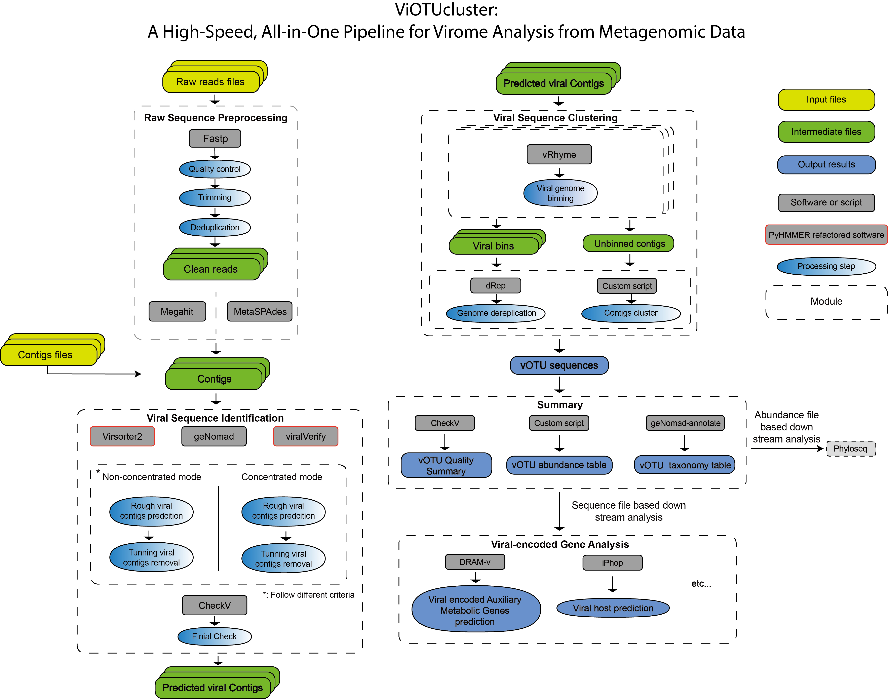

# ViOTUcluster: A High-Speed, All-in-One Pipeline for Viromic Analysis from Metagenomic Data
[](https://pypi.org/project/ViOTUcluster/)

ViOTUcluster is a high-speed, All-in-One solution that streamlines the entire viromics analysis workflow—from raw reads to the generation of viral operational taxonomic units (vOTUs) tables, which include abundance, taxonomy, and quality information, as well as assembled viral genomes, AMG prediction, and host prediction. ViOTUcluster supports the simultaneous processing of multiple samples, efficiently clustering viral sequences across datasets to generate vOTU-related files.



```
Sihang Liu
Dec 2024   
liusihang@tongji.edu.cn
College of Environmental Science and Engineering
Tongji University 
```
## Full Text & Citation
See more details in the [manuscript](https://doi.org/10.1002/imo2.70023) on iMetaOmics: 

```tex
Liu, S., Ye, Y., Guo, B., Hu, Y., Jiang, K., Liang, C., Xia, S. and Wang, H. (2025), ViOTUcluster: A high-speed, All-in-one pipeline for viromic analysis of metagenomic data. iMetaOmics e70023. https://doi.org/10.1002/imo2.70023
```
# Instruction
Demo for using ViOTUcluster

[](https://asciinema.org/a/710742)

_Recorded with [asciinema](https://docs.asciinema.org)_ 

#

1. [Prerequisites](#prerequisites)
2. [Installation](#installation)
3. [How to Use](#how-to-use)
4. [File Structure Example](#file-structure-example)
5. [Final Output](#final-output)
6. [Contact](#contact)

______
## Important updates

- Version 0.7.3: Keep VirSorter2 database setup and prediction in the installed main environment, fail immediately on incomplete database setup, and validate the required runtime dependencies. A clean CPU-only YAML installation and the bundled two-sample workflow passed on Linux with an existing database.
- Version 0.7.1: Made the Bioconda single-environment installation the recommended core-workflow setup and aligned vRhyme and CheckM runtime checks with that layout.
- Version 0.5.7.2: Added the `--save-sambamba-intermediate` flag (also available in `ViOTUcluster_AllinOne`) so you can keep Sambamba view BAMs when troubleshooting heavy IO pressure.
- Version 0.5.5: Added three concurrency controls options,`--max-prediction-tasks (-P)`, `--tpm-tasks (-T)`, `--assemble-jobs (-A)`, which could help to limit the over memory usage.

## Prerequisites

Before installing ViOTUcluster, ensure an environment manager is available on your system:

- [Miniconda](https://docs.conda.io/en/latest/miniconda.html) or [Anaconda](https://www.anaconda.com/products/distribution)
- [mamba](https://github.com/mamba-org/mamba) (recommended)
- [Git](https://git-scm.com/downloads) for source installations

## Installation

ViOTUcluster has been tested on Ubuntu and CentOS and should be compatible with all Linux distributions.

### Choose an Installation Method

| Method | Best for | Behavior |
| ------ | -------- | -------- |
| YAML-based source installation | Recommended for 0.7.3 | Solves five versioned environment files and installs the checked-out ViOTUcluster source. |
| Bioconda with mamba | Existing packaged installations | Installs the current Bioconda recipe, which may lag this repository and has not been validated for 0.7.3. |
| Pre-packed installation | Existing prepared-environment deployments | Downloads prepared environments from Zenodo or China SciDB; these archives have not been validated for 0.7.3. |

The YAML method installs the main environment plus separate vRhyme, viralverify, DRAM, and iPhop environments. Biological databases are separate from software installation; a complete existing database can be reused without downloading it again.

### YAML-Based Source Installation (Recommended for 0.7.3)

Clone the repository and install into a **new** prefix. The installer refuses to overwrite an existing environment:

```bash
git clone https://github.com/liusihang/ViOTUcluster.git
cd ViOTUcluster
python3 -c 'from ViOTUcluster.config import VERSION; print(VERSION)'  # expect 0.7.3

# CPU-only installation into a fresh prefix; use a path you can write to.
bash setup_ViOTUcluster_yaml.sh --cpu --prefix /PATH/TO/ViOTUcluster-0.7.3
conda activate /PATH/TO/ViOTUcluster-0.7.3
ViOTUcluster_Check
```

If a complete CheckM data directory already exists, pass `--checkm-data-dir /path/to/checkm_data` to the installer; it must contain `genome_tree/genome_tree.derep.txt`. This reuses CheckM reference data and avoids that download. It is independent of the VirSorter2 database.

Continue with [existing database reuse](#set-up-databases) and the [bounded mini-workflow test](#test-the-complete-viotucluster-workflow-with-mini-samples) below. The verified `--cpu` path does not need GPU libraries; omit `--cpu` only when GPU-enabled installation is required and separately validated on your host.

### Bioconda Installation (Not Yet the 0.7.3 Install Path)

The currently published Bioconda recipe is not yet the 0.7.3 install path. The command below documents the existing packaged route, but should not be used to claim that the 0.7.3 VirSorter2 fix is installed:

```bash
mamba create -n ViOTUcluster --strict-channel-priority -c conda-forge -c bioconda viotucluster
conda activate ViOTUcluster
ViOTUcluster_Check
```

The `checkm-genome` package may install its reference data during environment creation. To reuse a complete CheckM data directory that already contains `genome_tree/genome_tree.derep.txt`, pass it to the install process:

```bash
CHECKM_DATA_DIR=/path/to/checkm_data \
  mamba create -n ViOTUcluster --strict-channel-priority -c conda-forge -c bioconda viotucluster
```

The Bioconda 0.7.1 recipe depends on upstream `virsorter=2.2.4`, whereas the YAML installation pins the PyHMMER-based `VirSorter2-pyhmmerAcc=2.2.4.2` fork. These are different installation paths. Bioconda's recipe needs a separate update and clean-install validation before it can be recommended for 0.7.3.

On the Linux validation host, a clean GPU-enabled Bioconda installation downloaded about 3 GB of packages and produced an 8.3 GiB environment prefix. Exact sizes vary as dependency builds change; biological databases remain separate.

Use the source YAML installation above for the tested 0.7.3 path. Its database setup remains separate from software installation.

### YAML-Based Installation Options

To check that the CPU-only specifications solve without creating an environment:

```bash
bash setup_ViOTUcluster_yaml.sh --cpu --dry-run --prefix /PATH/TO/ViOTUcluster-0.7.3
```

For a GPU-enabled installation, omit `--cpu` and use a different new prefix:

```bash
bash setup_ViOTUcluster_yaml.sh --prefix /PATH/TO/ViOTUcluster-0.7.3-gpu
```

The `--cpu` option requires **mamba**. The installer selects CPU-specific main and iPhop YAML files and sets `CONDA_OVERRIDE_CUDA=""` internally, so users do not need to export that variable themselves. The verified specifications pin TensorFlow 2.11.1 for geNomad and TensorFlow 2.7.0 for iPhop to exact Linux/Python 3.8 CPU builds. iPhop 1.3.3 packages TensorFlow 2.7.0 files, so matching that version avoids mixing files from different TensorFlow releases. The normal command without `--cpu` continues to use the default YAML files.

**Disk space:** software environments and biological databases are separate. On the Linux validation host, a clean CPU-only software prefix measured **9.19 GiB**, compared with **15.72 GiB** for the previously validated default prefix (about 6.54 GiB, or 42%, smaller). CPU-only mode avoids the duplicated CUDA, cuDNN, and NCCL runtime packages; database downloads still require their own storage as described below. Exact size varies with platform and resolved package builds.

If a complete extracted CheckM data directory already exists, reuse it and avoid the CheckM post-link download:

```bash
bash setup_ViOTUcluster_yaml.sh --cpu --prefix /PATH/TO/ViOTUcluster-0.7.3 \
  --checkm-data-dir /path/to/checkm_data
```

The directory must contain `genome_tree/genome_tree.derep.txt`. Without this option, the `checkm-genome` Conda package downloads and verifies its standard reference data during environment creation.

The YAML installer:

- uses `conda-forge` and `bioconda` with strict channel priority without rewriting the user's global Conda configuration;
- supports optional `--cpu` installation through verified CPU-specific TensorFlow YAML files and mamba;
- creates `envs/vRhyme`, `envs/viralverify`, `envs/DRAM`, and `envs/iPhop` under the main prefix;
- pins the ViOTUcluster VirSorter fork to a specific Git commit;
- installs the current repository checkout with `pip --no-deps` after Conda resolves runtime dependencies;
- stages the bundled mini FASTQ files under `$CONDA_PREFIX/ViTest/Raw/CleanReads` for `ViOTUcluster_Test`;
- can reuse an existing read-only CheckM data directory through `--checkm-data-dir`;
- refuses to overwrite an existing target prefix.

Run `bash setup_ViOTUcluster_yaml.sh --help` for the full option list.

### Pre-Packed Installation (Not Yet Validated for 0.7.3)

ViOTUcluster also provides an **all-in-one setup script** that downloads and unpacks prepared environments. The downloaded archives are not automatically rebuilt when the GitHub source version changes; use the YAML source installation above for the validated 0.7.3 fix.

| Option                                            | What it does                                                                                               |
| ------------------------------------------------- | ---------------------------------------------------------------------------------------------------------- |
| `--china`                                         | Switch download source from Zenodo to China SciDB mirrors (faster in mainland CN).                         |
| `-p PATH`                                         | Install the whole stack *outside* your base Conda directory (default is `<conda-root>/envs/ViOTUcluster`). |
| `-h`, `--help`                                    | Show full option list.                                                                                     |

---

1.  **Download and Setup ViOTUcluster**

    ViOTUcluster simplifies the installation of itself and its core dependencies (like vRhyme, DRAM, and iPhop) by providing a setup script that downloads pre-packaged Conda environments.

    The setup script can be run directly using `wget` and `bash`.

    **Legacy pre-packed installation (downloads from Zenodo; not the validated 0.7.3 route):**
    This command will download the setup script and execute it, which will then download the environment packages from Zenodo.
    ```bash
    wget -qO- https://raw.githubusercontent.com/liusihang/ViOTUcluster/master/setup_ViOTUcluster.sh | bash
    ```

    **Alternative for Users in Mainland China (Downloads from China SciDB):**
    If you are in mainland China or experience slow downloads from Zenodo, you can instruct the script to use download mirrors hosted on China SciDB.
    ```bash
    wget -qO- https://raw.githubusercontent.com/liusihang/ViOTUcluster/master/setup_ViOTUcluster.sh | bash -s -- --china
    ```
    
    **For users who lack write access to the Conda base directory or who prefer to install to a custom location:**
    ```bash
    wget -qO- https://raw.githubusercontent.com/liusihang/ViOTUcluster/master/setup_ViOTUcluster.sh | bash -s -- -p /PATH/YOU/WANT
    ```

    You can combine flags, for example:

    ```bash
    wget -qO- https://raw.githubusercontent.com/liusihang/ViOTUcluster/master/setup_ViOTUcluster.sh | bash -s -- --china -p /PATH/YOU/WANT
    ```
    **Note:** When you install to a custom prefix, activate the environment with the full path, e.g.
    ```bash
    conda activate /YOUR/CUSTOM/PATH/ViOTUcluster
    ```

### Verify Installation of All Dependencies

   To confirm that all required dependencies are correctly installed, run:

   ```bash
   conda activate /PATH/TO/ViOTUcluster-0.7.3
   ViOTUcluster_Check
   ```

   The YAML installer already installs the checked-out source revision. For a pre-packed installation, run `pip install --upgrade ViOTUcluster` only when you intentionally want to switch the pipeline scripts to the currently published PyPI release.

   A successful check will produce output similar to this:

   ```bash
   Checking dependencies...
   [✅] fastp is installed.
   [✅] megahit is installed.
   [✅] spades.py is installed.
   [✅] virsorter is installed.
   [✅] viralverify is installed.
   [✅] genomad is installed.
   [✅] checkv is installed.
   [✅] vRhyme is installed.
   [✅] dRep is installed.
   [✅] checkm is installed.
   [✅] bwa is installed.
   [✅] sambamba is installed.
   [✅] parallel is installed.
   [✅] makeblastdb is installed.
   [✅] blastn is installed.
   All dependencies are installed.
   ```

   **Note:** `ViOTUcluster_Check` validates the commands and Python imports required by the core pipeline, including the VirSorter2 runtime in the main environment. It resolves `vRhyme` and `viralverify` from the active Bioconda environment, YAML-managed nested environments, or the sibling environments used by pre-packed installations. A pre-packed or existing Bioconda environment may need its dependencies updated before using this no-nested-Conda workflow; the source YAML specifications include them.

### Set Up Databases

   **Reuse a complete existing database:** point the pipeline to the *parent* database directory, containing `db/`, `ViralVerify/`, `genomad_db/`, and `checkv-db-v1.5/`. Do not append `/db` to the ViOTUcluster `-d` argument, and do not run the downloader again just to use existing data. Confirm the key VirSorter2 files before reuse:

   ```bash
   DB_ROOT=/path/to/existing/ViOTUcluster_db
   test -s "$DB_ROOT/db/hmm/viral/combined.hmm"
   for domain in Archaea Bacteria Eukaryota Mixed Viruses; do
     test -s "$DB_ROOT/db/hmm/pfam/Pfam-A-$domain.hmm" || { echo "Missing Pfam HMM: $domain" >&2; break; }
   done
   test -d "$DB_ROOT/db/group"
   test -d "$DB_ROOT/db/rbs"
   test -s "$DB_ROOT/ViralVerify/nbc_hmms.h3m"
   test -f "$DB_ROOT/genomad_db/version.txt"
   test -f "$DB_ROOT/checkv-db-v1.5/README.txt"
   ```

   If any check fails, inspect the incomplete database rather than assuming the missing HMM is the original error. Database setup now skips VirSorter2's internal dependency installation and exits on failure; the main environment must pass `ViOTUcluster_Check` first. Only when database installation is needed, use a separate writable target with sufficient space:

   ```bash
   ViOTUcluster_download-database "/path/to/db" "num"
   ```

   If the specified directory (`/path/to/db`) does not already contain the required databases, the script will download and install them automatically. Replace `/path/to/db` with the **parent** database directory and `num` with the number of threads to use during installation. For a previously failed partial download, prefer a new target or inspect and repair that directory before retrying; directory names alone do not prove a complete database.

   **Note:** The setup process involves downloading approximately **30 GB** of database files, so the installation time depends heavily on your **network speed**. A stable, high-speed internet connection is recommended to prevent installation failures.

### Set Up DRAM and iPhop Databases (Optional for Advanced Analysis)

   #### Install DRAM Database

   To install the DRAM database, first activate the `ViOTUcluster` environment and then run the setup command:

   ```bash
   conda activate ViOTUcluster
   DRAM-setup.py download "/path/to/db/DRAM"
   ```

   If you have an existing DRAM environment and want to migrate its settings, follow these steps:

   1. **Export Configuration from the Old Environment**:
      ```bash
      conda activate old_DRAM_env
      DRAM-setup.py export_config > my_old_config.txt
      ```

   2. **Import the Configuration into the New Environment**:
      ```bash
      conda activate ViOTUcluster
      DRAM-setup.py import_config my_old_config.txt
      ```

   ### Install iPhop Database

   To install the iPhop database, activate the `ViOTUcluster` environment and run the database download command:

   ```bash
   conda activate ViOTUcluster
   iPhop-setup.py "/path/to/db"
   ```

   ### Important Notes

   - **Database Storage**: Ensure that the databases for both DRAM and iPhop are stored in the directory specified during the `ViOTUcluster_download-database` step.
   - **Expected Database Structure**: For details on the expected database structure, refer to the [File Structure Example](#file-structure-example) section.
   - **Official Documentation**: For additional instructions on downloading and configuring these databases, refer to the official documentation for:
      - [DRAM](https://github.com/WrightonLabCSU/DRAM)
      - [iPhop](https://bitbucket.org/srouxjgi/iphop/src/main/).


### Test the Complete ViOTUcluster Workflow with Mini-Samples
  
   The source installer stages two paired mini FASTQ samples under `$CONDA_PREFIX/ViTest/Raw/CleanReads`. Run a bounded, full-workflow test in a **new output directory** using the existing database root:
   ```bash
   conda activate /PATH/TO/ViOTUcluster-0.7.3
   ViOTUcluster_AllinOne \
     -r "$CONDA_PREFIX/ViTest/Raw/CleanReads" \
     -o /PATH/TO/new-mini-test-output \
     -d "$DB_ROOT" \
     -a megahit --con \
     -n 8 -P 2 -T 1 -A 1 --module-timeout-hours 2
   ```
   `--con` matches this bundled test; choose `--con` or `--non-con` according to your own sample preparation for real analyses. `ViOTUcluster_Test -d "$DB_ROOT"` remains available, but it uses automatic concurrency and removes its previous `$CONDA_PREFIX/ViTest/Res` before running; the explicit command above avoids that overwrite.

   If you want a lighter smoke test while debugging orchestration or environment issues, you can also run the All-in-One entrypoint with reduced concurrency and disabled binning:

   ```bash
   conda activate /PATH/TO/ViOTUcluster-0.7.3
   ViOTUcluster_AllinOne \
     -r "$CONDA_PREFIX/ViTest/Raw/CleanReads" \
     -o /PATH/TO/new-lightweight-output \
     -d "$DB_ROOT" \
     -a megahit \
     --con \
     --disable-binning \
     -n 4 -P 1 -T 1 -A 1 \
     --module-timeout-hours 1
   ```

### Updating ViOTUcluster from an Older Version

For 0.7.3, use the clean source YAML installation above and a new prefix; keep the old environment until the mini test succeeds. Updating only the package inside an older Conda environment does not install the newly required VirSorter2 runtime dependencies.

For existing Bioconda installations (not yet the 0.7.3 path), use the same channel order as the initial installation:

```bash
mamba update -n ViOTUcluster --strict-channel-priority -c conda-forge -c bioconda viotucluster
```

For a YAML source installation, use the intended repository revision and create a new clean prefix with `setup_ViOTUcluster_yaml.sh`.


## Additional Notes

If you run into any difficulties while setting up these environments, feel free to report them by opening an issue on the respective GitHub or Bitbucket repositories for [DRAM](https://github.com/WrightonLabCSU/DRAM) or [iPhop](https://bitbucket.org/srouxjgi/iphop/src/main/).

---


## How to Use

To run the pipeline, use the following command structure:

1. **Run from assembled contigs plus raw reads**

    ```bash
    ViOTUcluster -i <input_path_to_contigs> -r <input_path_raw_seqs> -o <output_path> -d <database_path> -n <threads> -m <min-sequence length> --non-con/--con [--reassemble] [--disable-binning] [--save-sambamba-intermediate] [--max-prediction-tasks <N>] [--tpm-tasks <N>] [--assemble-jobs <N>] [--module-timeout-hours <H>]
    ```

2. **Start directly from raw FASTQ files**

    ```bash
    ViOTUcluster_AllinOne -r <input_path_raw_seqs> -o <output_path> -d <database_path> -a <assembly_software> -n <threads> -m <min-sequence length> --non-con/--con [--reassemble] [--disable-binning] [--save-sambamba-intermediate] [--max-prediction-tasks <N>] [--tpm-tasks <N>] [--assemble-jobs <N>] [--module-timeout-hours <H>]
    ```

A mini test file is available for download at  [MiniTest.zip](https://zenodo.org/records/14287325/files/MiniTest.zip?download=1). You can use this file in All-in-One mode to verify that the pipeline is successfully installed and functioning.

## Parameters

- **`-i <input_path_to_contigs>`**: Specifies the directory containing the assembled contig files in FASTA format (e.g., `example1.fasta`). Each contig file should have corresponding raw sequencing FASTQ files in the raw sequence directory, sharing the same prefix.

- **`-r <input_path_raw_seqs>`**: Specifies the directory with raw sequencing data in FASTQ format. The FASTQ files must have the same prefix as the corresponding contigs file. For example, if the contigs file is `example1.fasta`, the FASTQ files should be named `example1_R1.fq` and `example1_R2.fq`. The paired-end metagenomic reads should end with `.fq`, `.fq.gz`, `.fastq`, or `.fastq.gz`.

- **`-o <output_path>`**: Defines the output directory for storing the processed results. This will include filtered sequences, prediction outcomes, binning results, and the final dereplicated viral contigs.

- **`-d <database_path>`**: Points to the required database for performing viral prediction, binning, and dereplication steps.

- **`-m, --min-length <length>`**: Specify the minimum length (bp) for sequences (default: 2500). The same value is applied during initial contig filtering and again before dRep clustering to keep downstream analyses in sync with the user input.

- **`-n, --threads <N>`**: Sets the per-task thread budget passed to heavy external tools. Combine this with `-P`, `-T`, and `-A` to control total host utilization.

- **`--non-con/--con`**: Specifies the viral prediction criteria based on the sample preparation method. Use `--non-con` for samples that were not enriched using viral-particle concentration methods, typically containing a low viral proportion. Use `--con` for samples subjected to concentration methods, which are expected to have a medium to high viral proportion.

- **`--reassemble`**: (Optional) Enables reassembly of bins after the initial binning process to enhance the accuracy and quality of the final contigs. This feature is still in beta and can significantly increase runtime.

- **`--disable-binning`**: Skip the vRhyme binning stage entirely. When enabled, the pipeline stages the post-cross-validation per-sample viral contigs into the unbinned dereplication and summary flow, which is useful when bins cannot be recovered for some samples.
- **`--module-timeout-hours <hours>`**: Abort a top-level pipeline stage if it runs longer than the configured number of hours. Use `0` to disable the timeout entirely.
- **`--save-sambamba-intermediate`**: Keep Sambamba view BAMs before sorting. This reduces open-file pressure during heavy runs and keeps intermediate BAMs on disk for debugging at the cost of additional storage.

- **`-a <assembly_software>`**: (For `ViOTUcluster_AllinOne` only) Specifies the assembly software used during the raw sequence processing. Accepted values are `-a megahit` or `-a metaspades`.

- **`--max-prediction-tasks, -P <N>`**: Cap total concurrent prediction jobs (e.g., viralverify/virsorter2/genomad), default 30.

- **`--tpm-tasks, -T <N>`**: Cap concurrent BAM/TPM processing samples, default 15.

- **`--assemble-jobs, -A <N>`**: Cap concurrent assembly samples, default 10.

- **`ViOTUcluster_Check`**: Use this before long runs to confirm the command-line tools that the pipeline expects are visible from your current shell.

### File Structure Example

Below is a tree list of how the file structure should be organized, assuming the prefix for the example files is `example1`:

```plaintext
<project_directory>/
│
├── input_contigs/
│   ├── example1.fasta
│   ├── example2.fasta
│   └── ...
│
├── input_fastq/
│   ├── example1_R1.fq
│   ├── example1_R2.fq
│   ├── example2_R1.fq
│   ├── example2_R2.fq
│   └── ...
│
├── output_path/
│   ├── Summary/
│   │   ├── SeperateRes
│   │   │   ├── example1_viralseqs.fasta
│   │   │   ├── example2_viralseqs.fasta
│   │   │   └── ... 
│   │   ├── vOTU
│   │   │    ├── vOTU.fasta
│   │   │    ├── vOTU.Abundance.csv
│   │   │    ├── vOTU.Taxonomy.csv
│   │   │    └── CheckVRes
│   │   ├── DRAMRes(Optional)
│   │   │    ├── DRAM_annotations.tsv
│   │   │    └── DRAM_Gene.Abundance.csv
│   │   └── iPhopRes(Optional)
│   └── (IntermediateFile....)
│
└── databases/
    ├── db/                # VirSorter2 database
    ├── viralVerify/       # ViralVerify database
    ├── checkv-db-v1.5/    # CheckV database (version 1.5)
    ├── genomad_db/        # Genomad database
    └── Aug_2023_pub_rw/   # iPhop database
```

- `input_contigs/` contains the assembled contigs (e.g., `example1.fasta`).
- `input_fastq/` contains the corresponding FASTQ files (e.g., `example1_R1.fq` and `example1_R2.fq`).
- `output_results/` is the directory where all output files will be stored.
- `databases/` contains the required databases for the analysis, including:
  - `db/`: The VirSorter2 database.
  - `ViralVerify/`: The ViralVerify database.
  - `checkv-db-v1.5/`: The CheckV database (version 1.5).
  - `genomad_db/`: The Genomad database.

### Final Output

The processed data is organized under the specified `output_path/`, with the following structure:

- **`output_path/Summary`**: Contains the final results and summaries for all processed samples, organized into the following subdirectories:
  - **`SeperateRes`**: Holds individual directories for each sample (e.g., `example1`, `example2`):
    - **`<sample>_viralseqs.fasta`**: The list of predicted viral contigs for the respective sample.
  - **`vOTU/`**: Contains the final processed viral OTU (vOTU) results across all samples:
    - **`vOTU.fasta`**: The final dereplicated viral contigs after clustering from all samples.
    - **`vOTU.Abundance.csv`**: Abundance data of the vOTUs across samples.
    - **`vOTU.Taxonomy.csv`**: Taxonomic assignments for the vOTUs, if available.
    - **`CheckVRes`**: Summarized CheckV quality assessments for final vOTUs file.
  - **`DRAMRes (Optional)`**: Optional functional annotations from DRAM if the advanced analysis stage is executed.
    - **`DRAM_annotations.tsv`**: Aggregated DRAM annotations for all predicted genes.
    - **`DRAM_Gene.Abundance.csv`**: TPM-based abundance estimates for each DRAM-predicted gene across samples.
  - **`iPhopRes (Optional)`**: Optional results from iPhop annotation if included in the workflow.

- **`output_path/IntermediateFile`**: This directory holds intermediate files generated during the processing pipeline, such as filtered sequences and any temporary data.

- **`databases/`**: Stores the necessary databases used for various stages of the analysis:
  - **`db/`**: The VirSorter2 database.
  - **`ViralVerify/`**: The ViralVerify database, used for viral prediction.
  - **`checkv-db-v1.5/`**: The CheckV database (version 1.5) for quality control of viral sequences.
  - **`genomad_db/`**: The Genomad database for viral identification and dereplication.

## Acknowledgement

ViOTUcluster integrates state-of-the-art viromics analysis tools. The main tools within ViOTUcluster are listed below.

[fastp](fastp): [Online Publication](https://doi.org/10.1002/imt2.107)

```
Shifu Chen. 2023. Ultrafast one-pass FASTQ data preprocessing, quality control, and deduplication using fastp. iMeta 2: e107.
```

[MEGAHIT](https://github.com/voutcn/megahit): [Online Publication](https://doi.org/10.1093/bioinformatics/btv033)

```
MEGAHIT: An ultra-fast single-node solution for large and complex metagenomics assembly via succinct de Bruijn graph. Bioinformatics
```

[SPAdes](https://github.com/ablab/spades): [Online Publication](https://doi.org/10.1002/cpbi.102)

```
Prjibelski, A., Antipov, D., Meleshko, D., Lapidus, A., & Korobeynikov, A. (2020). Using SPAdes de novo assembler. Current Protocols in Bioinformatics, 70, e102. 
```

[geNomad](https://github.com/apcamargo/genomad): [Online Publication](https://doi.org/10.1038/s41587-023-01953-y)

```
Camargo, Antonio Pedro, Simon Roux, Frederik Schulz, Michal Babinski, Yan Xu, Bin Hu, Patrick SG Chain, Stephen Nayfach, and Nikos C. Kyrpides. "Identification of mobile genetic elements with geNomad." Nature Biotechnology (2023): 1-10. 
```

[viralVerify](https://github.com/ablab/viralVerify): [Online Publication](https://doi.org/10.1093/bioinformatics/btaa490)

```
Dmitry Antipov, Mikhail Raiko, Alla Lapidus, Pavel A Pevzner, MetaviralSPAdes: assembly of viruses from metagenomic data, Bioinformatics, Volume 36, Issue 14, July 2020, Pages 4126–4129
```

[VirSorter2](https://github.com/jiarong/VirSorter2): [Online Publication](https://doi.org/10.1186/s40168-020-00990-y)

```
Guo, Jiarong, Ben Bolduc, Ahmed A. Zayed, Arvind Varsani, Guillermo Dominguez-Huerta, Tom O. Delmont, Akbar Adjie Pratama et al. "VirSorter2: a multi-classifier, expert-guided approach to detect diverse DNA and RNA viruses." Microbiome 9 (2021): 1-13.
```

[PyHMMER](https://github.com/althonos/pyhmmer): [Online Publication](https://doi.org/10.1093/bioinformatics/btad214)

```
Martin Larralde, Georg Zeller, PyHMMER: a Python library binding to HMMER for efficient sequence analysis, Bioinformatics, Volume 39, Issue 5, May 2023, btad214
```

[CheckV](https://bitbucket.org/berkeleylab/CheckV): [Online Publication](https://doi.org/10.1038/s41587-020-00774-7)

```
Nayfach, S., Camargo, A.P., Schulz, F. et al. CheckV assesses the quality and completeness of metagenome-assembled viral genomes. Nat Biotechnol 39, 578–585 (2021)
```

[vRhyme](https://github.com/AnantharamanLab/vRhyme): [Online Publication](https://doi.org/10.1093/nar/gkac341)

```
Kieft, Kristopher, Alyssa Adams, Rauf Salamzade, Lindsay Kalan, and Karthik Anantharaman. "vRhyme enables binning of viral genomes from metagenomes." Nucleic Acids Research 50, no. 14 (2022): e83-e83.
```

[dRep](https://github.com/MrOlm/drep): [Online Publication](https://doi.org/10.1038/ismej.2017.126)

```
Olm, M., Brown, C., Brooks, B. et al. dRep: a tool for fast and accurate genomic comparisons that enables improved genome recovery from metagenomes through de-replication. ISME J 11, 2864–2868 (2017)
```

[CheckM](https://github.com/Ecogenomics/CheckM): [Online Publication](https://doi.org/10.1101/gr.186072.114)

```
Parks DH, Imelfort M, Skennerton CT, Hugenholtz P, Tyson GW. CheckM: assessing the quality of microbial genomes recovered from isolates, single cells, and metagenomes. Genome Res. 2015 Jul;25(7):1043-55
```

[BWA](https://github.com/lh3/bwa): [Online Publication](https://arxiv.org/abs/1303.3997)

```
Aligning sequence reads, clone sequences and assembly contigs with BWA-MEM.
```
[Sambamba](https://github.com/biod/sambamba): [Online Publication](https://doi.org/10.1093/bioinformatics/btv098)
```
Artem Tarasov, Albert J. Vilella, Edwin Cuppen, Isaac J. Nijman, Pjotr Prins, Sambamba: fast processing of NGS alignment formats, Bioinformatics, Volume 31, Issue 12, June 2015, Pages 2032–2034
```

[DRAM](DRAM): [Online Publication](https://doi.org/10.1093/nar/gkaa621)

```
Michael Shaffer, Mikayla A Borton, Bridget B McGivern, Ahmed A Zayed, Sabina Leanti La Rosa, Lindsey M Solden, Pengfei Liu, Adrienne B Narrowe, Josué Rodríguez-Ramos, Benjamin Bolduc, M Consuelo Gazitúa, Rebecca A Daly, Garrett J Smith, Dean R Vik, Phil B Pope, Matthew B Sullivan, Simon Roux, Kelly C Wrighton, DRAM for distilling microbial metabolism to automate the curation of microbiome function, Nucleic Acids Research, Volume 48, Issue 16, 18 September 2020, Pages 8883–8900
```

[iPHoP](https://bitbucket.org/srouxjgi/iphop/src/main/): [Online Publication](https://www.biorxiv.org/content/10.1101/2022.07.28.501908v1)

```
Roux, Simon, Antonio Pedro Camargo, Felipe Hernandes Coutinho, Shareef M. Dabdoub, Bas E. Dutilh, Stephen Nayfach, and Andrew Tritt. "iPHoP: an integrated machine-learning framework to maximize host prediction for metagenome-assembled virus genomes." bioRxiv (2022): 2022-07.
```

______

## Contact

Feel free to contact Sihang Liu (<liusihang@tongji.edu.cn> or GitHub Issues) with any questions or comments!

```
####################################################################################################
██╗   ██╗██╗ ██████╗ ████████╗██╗   ██╗ ██████╗██╗     ██╗   ██╗███████╗████████╗███████╗██████╗ 
██║   ██║██║██╔═══██╗╚══██╔══╝██║   ██║██╔════╝██║     ██║   ██║██╔════╝╚══██╔══╝██╔════╝██╔══██╗
██║   ██║██║██║   ██║   ██║   ██║   ██║██║     ██║     ██║   ██║███████╗   ██║   █████╗  ██████╔╝
╚██╗ ██╔╝██║██║   ██║   ██║   ██║   ██║██║     ██║     ██║   ██║╚════██║   ██║   ██╔══╝  ██╔══██╗
 ╚████╔╝ ██║╚██████╔╝   ██║   ╚██████╔╝╚██████╗███████╗╚██████╔╝███████║   ██║   ███████╗██║  ██║
  ╚═══╝  ╚═╝ ╚═════╝    ╚═╝    ╚═════╝  ╚═════╝╚══════╝ ╚═════╝ ╚══════╝   ╚═╝   ╚══════╝╚═╝  ╚═╝
####################################################################################################
```

______

## Copyright

ViOTUcluster Copyright (C) 2025

This program is free software: you can redistribute it and/or modify it under the terms of the GNU General Public License, version 2, as published by the Free Software Foundation.

This program is distributed in the hope that it will be useful, but WITHOUT ANY WARRANTY; without even the implied warranty of MERCHANTABILITY or FITNESS FOR A PARTICULAR PURPOSE. See the GNU General Public License for more details.

You should have received a copy of the GNU General Public License along with this program. If not, see <https://www.gnu.org/licenses/old-licenses/gpl-2.0.en.html>.
